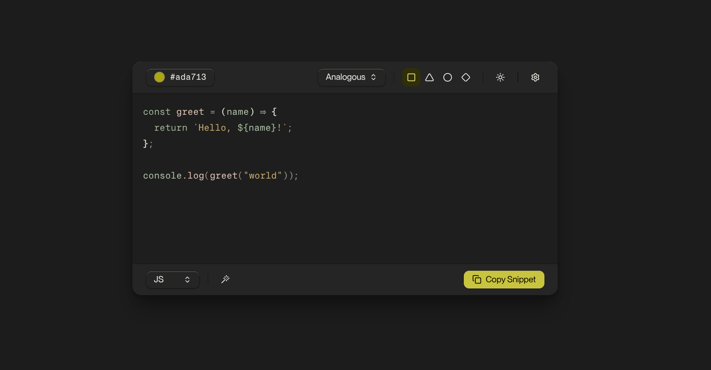

# ColorCode Pro

Generates dynamic syntax-highlighted code snippets and editor themes.

## Theme Generation

1. Pick your base color. Use the color picker or input a hex code. The base color drives all theme types and styles.
2. Choose your theme type, which follow color relationships. Analogous represents colors near each other on the colorwheel, while complementary opposite colors. 
3. The shapes (square, triangle, circle, diamond) indicate your theme style, increasing in chroma, left to right. Diamond verges on a neobrutalist design.
4. Flip between light and dark mode themes with the sun/moon toggle.

## Code Snippets

Get HTML color-encoded code snippets for your blog post. Each snippet includes dark and light variants.

1. Under the settings menu, download the base CSS and JS, and add them to your website.
2. Copy the code snippet and add to your site. 

## Themes

Found a theme you like? Download it for VS Code (and forks), Zed, Ghostty, and iTerm2. Download button in the settings menu. See
